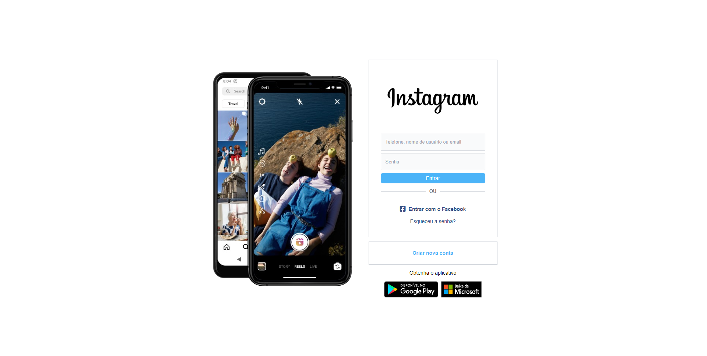

# Login Instagram

## Descrição
Este projeto é uma aplicação web desenvolvida para ser uma copia da pagina de login do site instagram, copiando os elementos identicamente e mantendo a responsividade igualmente ao site original.

## Demonstração

## Instalação
1. Clone este repositório: `git clone https://github.com/EltonKasesky/Login-Instagram.git`
- Abra o arquivo `index.html` no seu navegador.

2. Abra o link abaixo, e veja o site hospedado na Vercel
- Link: [`Pagina Login Instagram`](https://login-facebook-kasesky.vercel.app)

## Funcionalidades
1. Responvidade
- Está aplicação web foi desenvolvida com arquitetura responsiva.

2. UI/UX Figma
- Foi utilizado a ferramenta figma para desenvolver o design deste site

3. Tailwind CSS
- Foi utilizado o framework tailwindcss no desenvolvimento desta aplicação

4. Tecnologias utilizadas
- HTML
- CSS
- TailwindCSS
- JavaScript

## Contribuindo
Contribuições são bem-vindas! Abra uma issue ou envie um pull request para sugerir melhorias, correções de bugs etc.

## Autor
- [Elton Giglio Kasesky](https://github.com/EltonKasesky)